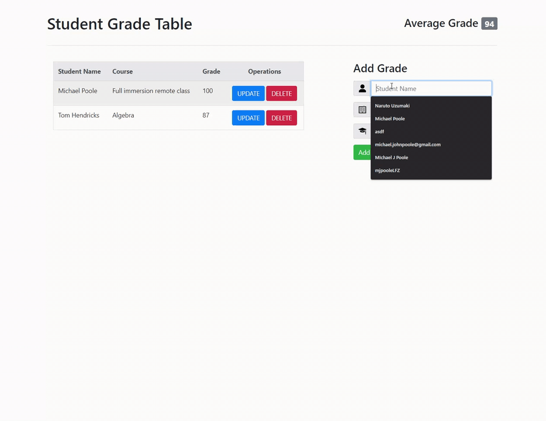

# Student Grade Table

An interactive JavaScript application that communicates with a server to manage grade records.

## Technologies Used

- Bootstrap 4
- HTML 5
- CSS 3
- JavaScript ES5
- jQuery AJAX
- OOP

## Features

- Teacher can view grades.
- Teacher can view average grade.
- Teacher can add grades.
- Teacher can delete grades.
- Teacher can update grades.

## Preview



## Getting Started

1. Clone the repository.
```
git clone https://github.com/MichaelPooleLF/api-hackathon.git
```
2. Open the file through a code editor and open default browser from ```index.html``` file.
  
